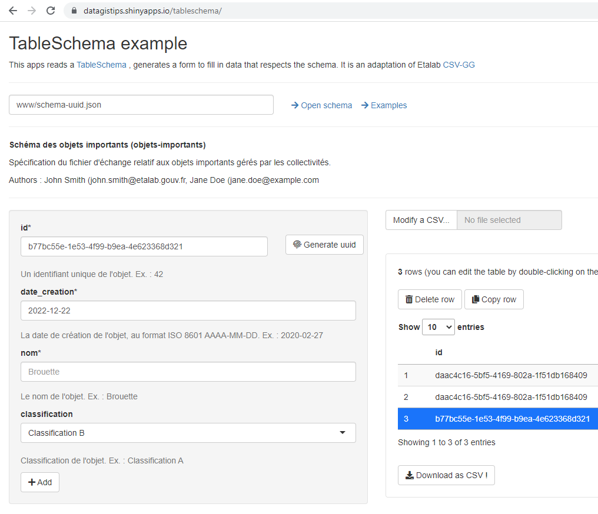

# TableSchema example
This app reads a TableSchema file to generate a form to create data

## Features
- Select and Read **remote** or **local** TableSchema
- **Add**, **Edit**, **Delete**, **Copy** rows
- **Download** as **CSV** and **Upload** an existing CSV file
- Generate **synthetic** **data** (to be done)

[TO DO list](TODO.md)